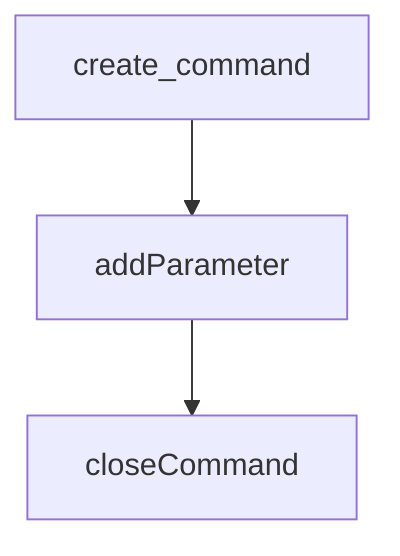

# udmilla-whatsapp-bot

Udmilla it's a small bot for Whatsapp made with [whatsapp-web.js](https://github.com/pedroslopez/whatsapp-web.js).

## Quick links

* [Quick Start](#quick-start)
* [Create command](#create-command)
    * [Alias](#command-alias)
    * [Callback](#command-callback)
    * [Options](#command-options)
    * [Command info](#command-info)
    * [Parameters info](#parameters-info)
* [Send response](#send-response)
* [Examples](#examples)
* [Hot-swap](#hot-swap)


## Quick Start

Node v12+ is required.

### 1. Clone repository

```console
git clone https://github.com/Lautauro/udmilla-whatsapp-bot.git
```

### 2. Install packages

```console
npm i
```

### 3. Build and log in Whatsapp Web

```console
npm run build
npm start
```

Scan the QR code.

### 4. Done

Start playing!


You can change the command prefix **"."** in **src/config/commands.json**.

## 

## Create command

Go to **src/modules/commands/** and open **commands_list.ts**.


To create a command you need to use the [create_command](#create-command) function.

```js
create_command(['alias'],
    callback(),
    { 
        // Command options
        // * Optional
    },
    { 
        // Command info
        // * Optional, but recommended
    })
.closeCommand(); // Add command to list
```

It is very important not to forget to add "closeCommand" at the end, otherwise the command will not be recognised by the bot.



### Command alias:

Names by which the command can be invoked

```js
create_command(['ping', 'pingpong', 'p']) /* etc... */
```
### Command callback:

When a command is invoked, this function is called. You can read the arguments passed by the user using the "args" variable, and use the "message" object to interact with the chat.

```js
create_command(['alias'],
    // My callback:
    (args, message) => {
        if (args[0] === 'Hi') {
            // Send "Hello!"
            send_response('Hello!', message);
        } else {
            // Send "Bye!"
            send_response('Bye!', message);
        }
    } /* etc... */)
.closeCommand(); // Add command to list
```
[Send Response](#send-response)

### Command options:

```js
{
    // If true, command can only be executed by admin
    adminOnly: boolean,

    // The command must be or not a quoted message
    needQuotedMessage: boolean,
}
```

### Command info:

This information will be used by the "help" command to describe the command itself.

```js
{
    name: string,           // Command name
    description: string     // What it does
}
```

## Command Parameters:

### Parameters info:

This information will be used by the "help" command to describe the parameter.

```js
{
    name: string,           // Parameter name
    description: string,    // What it does
    example: string         // Example value for parameter
}
```

## Send Response

Send a message to a chat.

```js
function send_response(MessageContent, Message, options?)
```

### Message Content

```ts
type MessageContent = string | MessageMedia | Location | Poll | Contact | Contact[] | List | Buttons
```

See: https://docs.wwebjs.dev/Client.html#sendMessage

### Command response options

```js
// All are optional
{
    reply: boolean;     // Send message as a reply
    asError: boolean;   // Send message as error
    reaction: string;   // Reaction to message. Example: "🐕‍🦺"
    messageOptions: MessageSendOptions;
}
```

For more information on MessageSendOptions, see: https://docs.wwebjs.dev/global.html#MessageSendOptions

## Examples:

Command with **no arguments**
```js
createCommand(
    ['ping', 'pingpong'],
    (args, message) => {
        send_response('Pong!', message, {
            reaction: '🏓',
        })
    },
    {
        adminOnly: true,
    },
    {
        name: 'Ping',
        description: 'Ping-pong! 🏓',
    })
.closeCommand();
```

Command with arguments:

```js
createCommand(['cite'],
    (args, message) => {
        send_response(
            `*" ${args[0].trim()} "*\n\n` + 
            `- _${(await message.getChat()).name}_`, // Username
            message
        )
    },
    null,
    {
        name: 'Cite this',
        description: 'This command returns a cite from the user.'
    })
    .addParameter('string',
    undefined,
    {
        name: 'cite',
        example: 'Theory and practice sometimes clash. And when that happens, theory loses. Every single time.'
    })
.closeCommand();
```

Command with **quoted message**:

```js
createCommand(['quote', 'cite'],
    async (args, message) => {
        message.getQuotedMessage().then((quotedMessage) => {
            if (quotedMessage.type === 'chat') {
                send_response(
                    `*" ${quotedMessage.body} "*\n\n` + 
                    `- _${quotedMessage._data.notifyName}_`,
                    message
                );
            }
        })
    },
    // Command options
    {
        needQuotedMessage: true
    },
    // Command info
    {
        name: 'Quote this',
        description: 'This command makes an author quote with the selected message. It needs to quote a message to work.'
    })
.closeCommand();
```

## Hot-swap

// TODO: