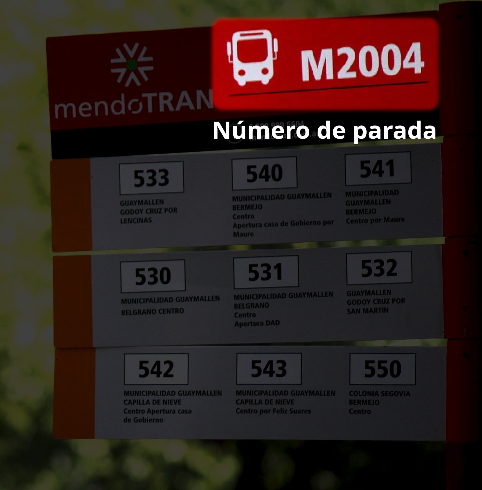
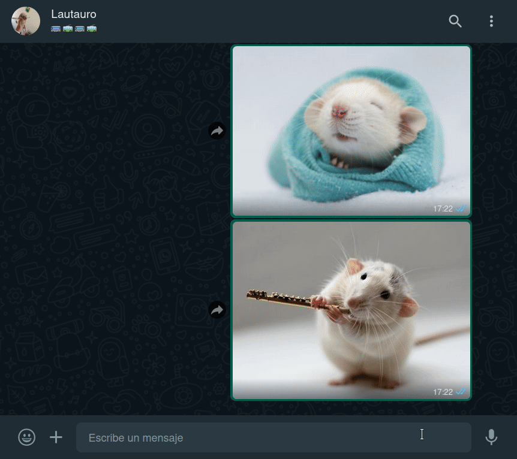
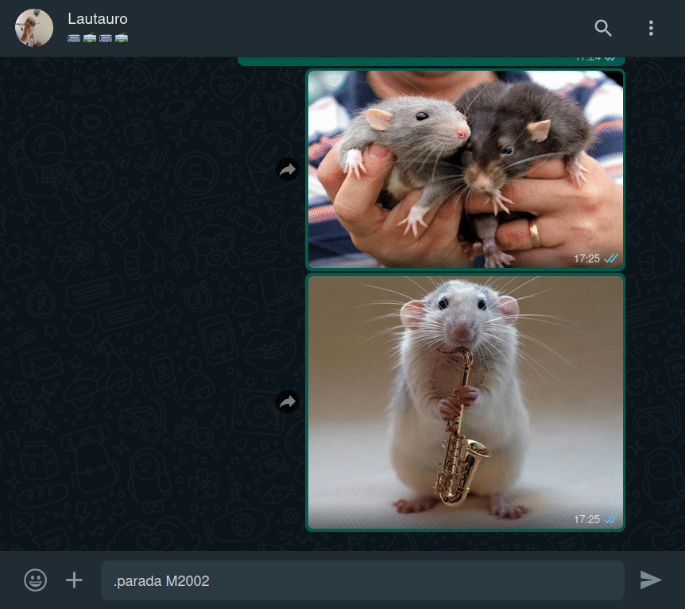
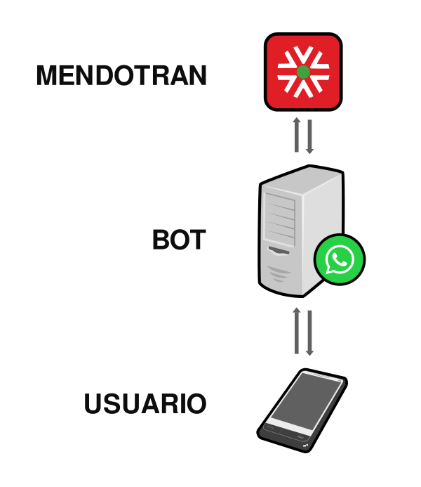
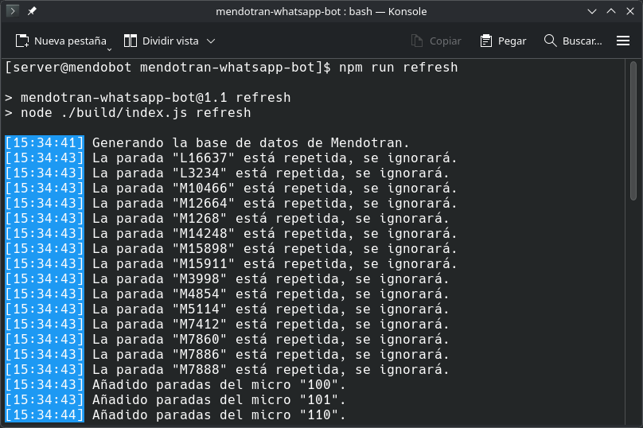
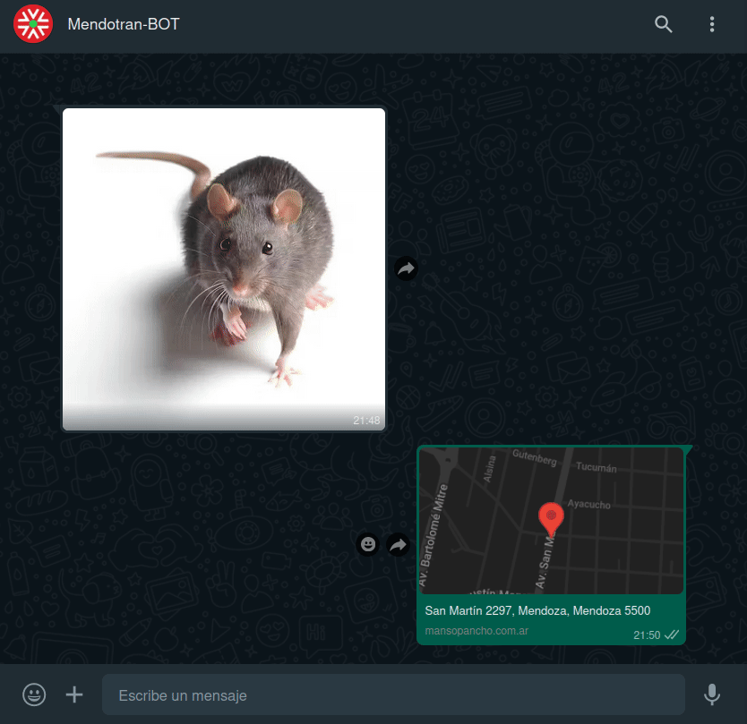
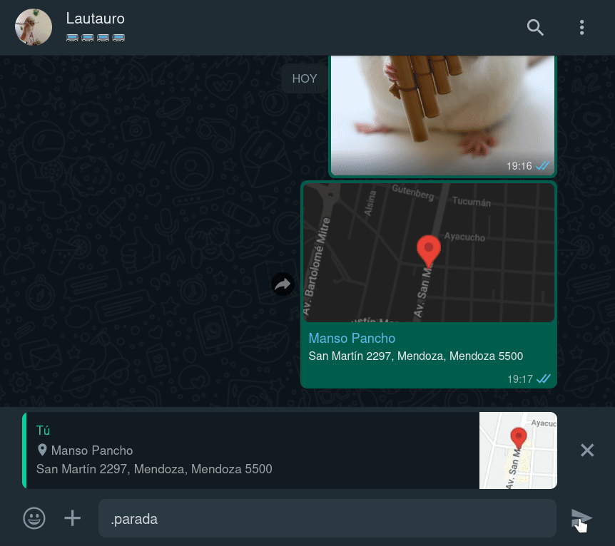

<h1 align="center">mendotran-whatsapp-bot</h1>

<div align="center">

</div>

**Mendotran-whatsapp-bot**, como su nombre bien indica, es un bot para WhatsApp el cual nos permite, valiéndose del servicio [Mendotran](https://mendotran.mendoza.gov.ar/), saber los horarios de una parada de colectivos a través del uso de comandos.

<div align="center">

</div>

*Fuente de la fotografía: ["MendoTran: comenzaron a instalar la señalética en algunas paradas" - Diario El Sol Mendoza](https://www.elsol.com.ar/el-sol/mendotran-comenzaron-a-instalar-la-senaletica-en-algunas-paradas/)*

<div align="center">

</div>

<div align="center">

</div>

> [!NOTE]
> Puede omitir la "M" y dejar solo el número de parada. 

En el caso que la parada no posea cartel, o el mismo esté vandalizado, el bot puede [localizarla usando su ubicación](#parada-cercana-a-tu-ubicación).

## Guia
* [Instalación](#instalación)
* [¿Cómo funciona?](#cómo-funciona)
* [Parada cercana a tu ubicación](#parada-cercana-a-tu-ubicación)
* [Pros y contras](#pros-y-contras)
* [Lista de comandos](#lista-de-comandos)
* [Cosas por hacer](#cosas-por-hacer)

*Núcleo del bot: [udmilla-whatsapp-bot](https://github.com/Lautauro/udmilla-whatsapp-bot). Librería: [whatsapp-web.js](https://github.com/pedroslopez/whatsapp-web.js)*

## Instalación

### 1. Clonar el repositorio

```bash
git clone https://github.com/Lautauro/mendotran-whatsapp-bot.git
cd mendotran-whatsapp-bot
```

### 2. Instalar paquetes

```bash
npm i
```

### 3. Compilar el proyecto 

```bash
npm run build
```

### 4. Iniciar servidor

```bash
npm start
```

**La primera vez que inicie el servidor sucederán dos cosas:**

1. Se generará una base de datos local que servirá para comunicarse con Mendotran.
2. Tendrá que sincronizar, a través del escaneo de un QR, la cuenta que usará de bot.

## ¿Cómo funciona?

<div align="center">

</div>

*Fuentes: [smartphone.svg](https://commons.wikimedia.org/wiki/File:Smartphone-.svg) [whatsapp-icon.svg](https://commons.wikimedia.org/wiki/File:2062095_application_chat_communication_logo_whatsapp_icon.svg) [server.svg](https://commons.wikimedia.org/wiki/File:Server2_by_mimooh.svg)*

La primera vez que inicie el bot (como ilustra la imagen de abajo) hará una serie de peticiones al servidor de Mendotran con el fin de generar una base de datos local del mismo, ésta contendrá información sobre los colectivos y paradas de la ciudad de Mendoza. Luego de generarla puede encontrar el archivo en **/build/json/mendotran-data.json** .

<div align="center">

</div>

Así se verá más o menos la estructura de la base de datos:

```json
"stops": {
    "M8845": {
        "id": "1606_62489",
        "position": {
            "lat": "-33.2228834",
            "lon": "-68.8925633"
        },
        "address": "Av. San Martín (Luján de Cuyo, Mendoza)",
        "busList": [
            "701",
            "705",
            "704",
            "708"
        ]
    }
},
"buses": {
    "701": {
        "linea": "701",
        "id": "1606_166733",
        "shortName": "701 UGARTECHE - Bº TIERRA SOL Y LUNA",
        "color": "🟦"
    }
}
```

Todos esta información será de gran utilidad para el bot a la hora de solicitar los horarios de un colectivo. Si por algún motivo quiere o necesita regenerar este archivo, bastará con iniciar el bot de la siguiente manera:

```bash
npm run refresh
```

Así se creará una nueva base de datos y el archivo viejo será conservado bajo el nombre de **mendotran-data.json.old** .

> [!NOTE]
> En mi experiencia el número de paradas de colectivo que recolecta varía según si se hace un día de semana o un fin de semana. No estoy seguro del porqué de esto pero es necesario que lo mencione.

## Parada cercana a tu ubicación

Si se desconoce el número de parada, enviando una ubicación al bot y respondiendo a la misma con alguno de los comandos, el sistema se encargará de buscar la parada más cercana y despachar sus horarios.

Comando **"micro"**, para saber los horarios de **un colectivo** en específico:

<div align="center">

</div>

Comando **"parada"**, para mostrar los horarios de **todos los colectivos** de una parada:

<div align="center">

</div>

## Pros y contras

|PROS |CONTRAS|
|:---:|:---:  |
|En caso de tener WhastApp gratis con su compañía de celular, **no necesita gastar datos entrando a la app oficial de Mendotran**.|**Usted deberá hostear el bot** por su cuenta en un servidor, o bien valerse de uno alojado por otro usuario.|
|Puede hasta ser **más rápido que usar la aplicación oficial**. Esto dependerá de la velocidad del servidor y de la experiencia previa del usuario con el uso de bots.|**Requiere más o menos tiempo habituarse a la lógica de los comandos.** Habrá personas que prefieran el uso de una interfaz gráfica de usuario ([GUI](https://en.wikipedia.org/wiki/Graphical_user_interface)) antes que una interfaz de texto ([TUI](https://en.wikipedia.org/wiki/Text-based_user_interface)).|
|Si la privacidad le parece un tema importante, en principio **ésta forma de usar el servicio debería ser más privada**, ya que no es el cliente quien hace las peticiones a Mendotran sino el servidor (Menos riesgo de recolección de datos). Más info en como usa nuestros datos la *app oficial* [aquí](https://mendotran.mendoza.gov.ar/politica).|Estás usando WhatsApp, si la privacidad es algo que te concierne probablemente estés en el sitio equivocado. **Mendotran afirma en su [Play Store](https://play.google.com/store/apps/details?id=com.wara.mendotran&hl=es_AR) que no recolecta datos del usuario, sin embargo se contradice en las [políticas de privacidad](https://mendotran.mendoza.gov.ar/politica) de su sitio web.**|
|No tiene que tener instalada la aplicación de Mendotran en su celular, lo que es igual a **más espacio libre**.|**Necesita saber el número de la parada de colectivos**, en el caso contrario puede pedirle al bot que [busque la parada más cercana a su ubicación actual](#parada-cercana-a-tu-ubicación). Esto último hace que pierda sentido el punto de usar menos datos, ya que Google Maps haría uso de los mismos.|

## Lista de comandos

Para ejecutar un comando debe estar acompañado por el prefijo **"."** *(punto)* seguido del alias del comando *(sin espacio)* y los parámetros *(estos sí espaciados)*.

|Alias|Sintaxis|Función|Ejemplo|
|:---:|:---|:---:|:---|
|**micro<br>m**|micro *[número de micro]* *[número de parada]*|Obtener los horarios de **un colectivo** en una parada.|.micro **120** **M14408**<br>(La "M" es opcional)|
|**parada<br>p**|parada *[número de parada]*|Obtener **todos** los horarios de una parada de colectivos.|.parada **M5707**<br>(La "M" es opcional)|
|**estacion**<br>**metro**|estacion *[nombre de la estación]*|Obtener los horarios de **una estación de metrotranvía**.|.estacion **Godoy**|
|**help<br>?**|help *[comando]*|Solicitar información sobre el uso de un comando.|.help **micro**|

También existe la alternativa de localizar una parada por cercanía. Tan solo basta con enviar una ubicación, citarla y utilizar alguno de los comandos. [Vea el ejemplo](#parada-cercana-a-tu-ubicación).

## Cosas por hacer:

Lejos de ser este el estado final del proyecto, aún hay cosas que tengo pensadas implementar en un futuro. Si lo desea y tiene las habilidades para hacerlo puede contribuir al mismo.

Alguna de mis ideas son:

- [ ] Sistema para que el usuario pueda guardar una parada o micro con un nombre. Por ejemplo: guardar la parada cercana a su hogar como "casa", entonces para saber los horarios de esa parada solo basta escribir **".micro 123 casa"** o **".parada casa"**.
- [ ] Comando para listar todas las paradas cercanas respecto a una ubicación. Esto le permitiría al usuario conocer las paradas cercanas y las calles en las que se ubican.