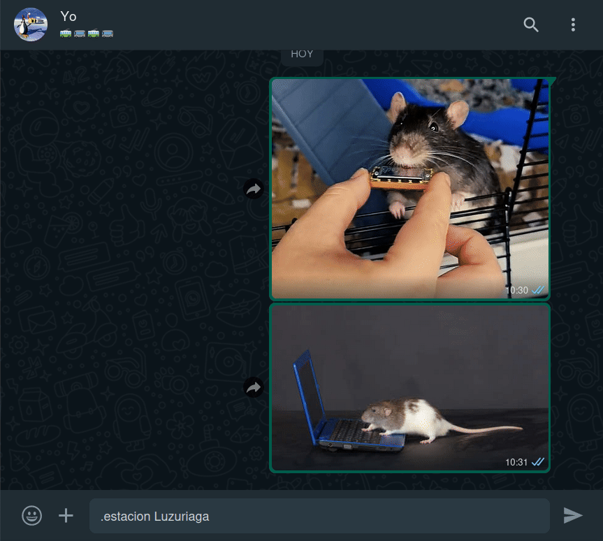
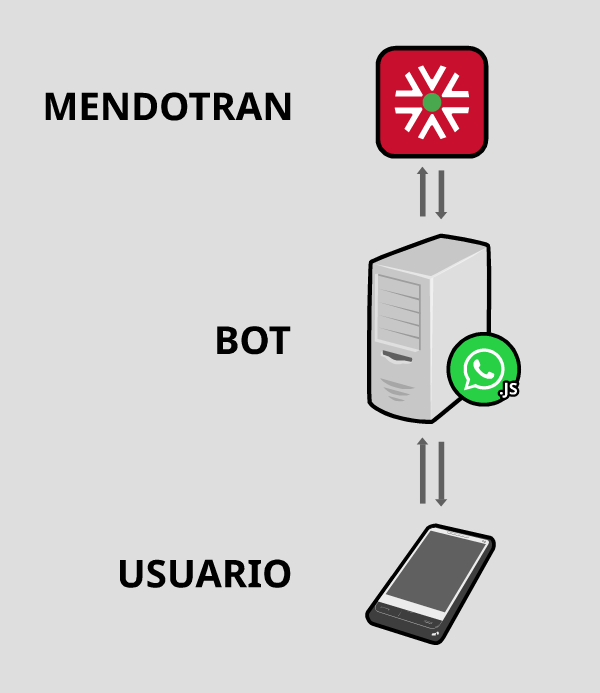

<h1 align="center">mendotran-whatsapp-bot</h1>

<div align="center">

</div>

**Mendotran-whatsapp-bot** es un bot para WhatsApp que permite a los usuarios consultar los horarios de colectivos de la provincia de Mendoza de manera rápida y sencilla. Valiéndose del servicio [Mendotran](https://mendotran.mendoza.gov.ar/) y la librería [whatsapp-web.js](https://github.com/pedroslopez/whatsapp-web.js), el bot responde a comandos específicos para proporcionar información sobre los horarios de paradas y líneas de colectivos específicas, así como también sobre el metrotranvía. 

*Núcleo del bot: [udmilla-whatsapp-bot](https://github.com/Lautauro/udmilla-whatsapp-bot).*

## Guia
* [Identificar parada](#identificar-parada)
* [Lista de comandos](#lista-de-comandos)
* [Demostración](#demostración)
* [Instalación](#instalación)
* [¿Cómo funciona?](#cómo-funciona)
* [Parada cercana a tu ubicación](#parada-cercana-a-tu-ubicación)
* [Pros y contras](#pros-y-contras)
* [Descargo de responsabilidad](#descargo-de-responsabilidad)

## Identificar parada

<div align="center">

</div>

*Fuente de la fotografía: ["MendoTran: comenzaron a instalar la señalética en algunas paradas" - Diario El Sol Mendoza](https://www.elsol.com.ar/el-sol/mendotran-comenzaron-a-instalar-la-senaletica-en-algunas-paradas/)*

## Lista de comandos

|                    Alias                    | Sintaxis                           |                                             Función                                             | Ejemplo                  |
|:-------------------------------------------:|------------------------------------|:-----------------------------------------------------------------------------------------------:|--------------------------|
|        **❓<br>Ayuda<br>Help<br>?**         | Ayuda *[Comando]*                  |                        Recibir información acerca del uso de un comando.                        | Ayuda **Micro**          |
|            **🚍<br>Micro<br>M**             | Micro *[Línea]* *[Nº de parada]*   |                 Obtener los horarios de **UN** colectivo en determinada parada.                 | Micro **120** **M14408** |
|            **🚏<br>Parada<br>P**            | Parada *[Nº de parada]*            |                   Obtener **TODOS** los horarios de una parada de colectivos.                   | Parada **M5707**         |
|              **📍<br>Paradas**              | **> [Citar ubicación]**<br>Paradas | **ACTUALMENTE DESHABILITADO DESDE LA VERSIÓN 1.1**. Lista las paradas cercanas a una ubicación. | Paradas                  |
| **🚊<br>Estación<br>Metro<br>Metrotranvía** | Estacion *[Nombre de la estación]* |                      Obtener los horarios de una estación de metrotranvía.                      | Estacion **Godoy**       |
<!---
> [!NOTE]
> Existe la alternativa de localizar una parada por cercanía a una ubicación. Tan solo basta con enviar primero la ubicación, citarla (es decir darle a "responder" al mensaje) y utilizar alguno de estos comandos: parada, micro ó paradas. [Vea el ejemplo](#parada-cercana-a-tu-ubicación).
--->

## Demostración

### Horario de un micro específico en una parada
<div align="center">

</div>

### Todos los horarios de una parada
<div align="center">

</div>

> [!NOTE]
> Puede omitir la "M" y dejar solo el número de parada. 

En el caso que la parada no posea cartel, o el mismo esté vandalizado, el bot puede [localizarla usando su ubicación](#parada-cercana-a-tu-ubicación).

### Horarios del [metrotranvía](https://stmendoza.com/metrotranvia/) en cierta estación

<div align="center">

</div>

> [!NOTE]
> Este comando admite 4 formas de ser invocado, más información en la lista de comandos.

## Instalación

### 1. Instalar dependencias

Instale los siguientes paquetes utilizando un gestor de paquetes en Linux o bien manualmente en Windows.

```bash
npm chromium git
```

> [!WARNING]
> En **Windows** es probable que tenga que cambiar la línea **"/usr/bin/chromium"**
> en **/src/modules/whatsapp/client.ts** por la ruta de chromium en su sistema.

### 2. Clonar el repositorio

```bash
git clone https://github.com/Lautauro/mendotran-whatsapp-bot.git
cd mendotran-whatsapp-bot
```

### 3. Instalar paquetes NPM

```bash
npm i
```

### 4. Compilar el proyecto e iniciar el servidor

```bash
npm run dev
```
> [!NOTE]
> Puede también usar ```npm build``` para compilar el proyecto y luego ejecutarlo con ```npm start```. 

La primera vez que inicie el servidor tendrá que escanear un QR para sincronizar la cuenta de WhatsApp que utilizará el bot. Es recomendable usar un número de teléfono celular específico para este uso, ya que que el bot utiliza la librería [whatsapp-web.js](https://github.com/pedroslopez/whatsapp-web.js) para funcionar y esta NO es soportada oficialmente por Meta. Esto quiere decir que, a pesar de que en mi experiencia no ha sucedido, **la cuenta puede ser baneada si Meta considera que incumple alguna de sus normas**. 

## ¿Cómo funciona?

<div align="center">

</div>

*Fuentes: [smartphone.svg](https://commons.wikimedia.org/wiki/File:Smartphone-.svg) [whatsapp-icon.svg](https://commons.wikimedia.org/wiki/File:2062095_application_chat_communication_logo_whatsapp_icon.svg) [server.svg](https://commons.wikimedia.org/wiki/File:Server2_by_mimooh.svg) [Isotipo de Mendotran](https://designacomunicacion.com/wp-content/uploads/2025/05/manual-corporativo-mendotran.pdf)*

El bot utiliza una versión local de la base de datos de Mendotran ubicada en **.json/**, en especial hablamos de los archivos **mendotran-buses.json** y **mendotran-stops.json**. Esto es especialmente útil para reducir la cantidad de peticiones que se hacen al servidor de Mendotran. Si por cualquier motivo necesita regenerar este archivo, bastará con iniciar el bot de la siguiente manera:

```bash
npm run refresh
```

Esto sobreescribirá a **mendotran-buses.json** y **mendotran-stops.json**. Los archivos viejos serán conservados bajo el nombre de **mendotran-buses.json.old** y **mendotran-stops.json.old** respectivamente.

> [!NOTE]
> En mi experiencia el número de paradas de colectivos detectadas por la regeneración de la base de datos varía según si se ejecuta un fin de semana o no. No estoy seguro del porqué de esto pero es necesario que lo mencione.

<div align="center">

</div>

Así se ve más o menos la estructura de la base de datos:

```json
// Versión de la base de datos:
"version": 1,
// Lista de paradas:
"stops": {
	// Número de la parada
	"M8845": {
		// ID interna:
		"id": "1606_62489",
		// Dirección:
		"address": "Av. San Martín (Luján de Cuyo, Mendoza)",
		// Colectivos que paran ahí:
		"busList": [
			"701",
			"704",
			"705",
			"708",
			"713",
			"714",
			"764",
			"766",
			"767"
		]
    }
},
// Lista de micros:
"buses": {
	// Número de la línea
	"701": {
		// ID interna:
		"id": "1606_166733",
		// Cartel del micro:
		"shortName": "701 UGARTECHE - Bº TIERRA SOL Y LUNA",
		// Color del colectivo:
		"color": "🟦"
	}
}
```

## Parada cercana a tu ubicación

> [!WARNING]
> Esta funcionalidad fue borrada debido a una actualización en la API de Mendotran.
> Es preciso buscar una forma de re-implementarla.

Si se desconoce el número de parada, enviando una ubicación al bot y respondiendo a la misma con alguno de los comando (parada, micro, etc), el sistema se encargará de buscar la parada más cercana y despachar sus horarios.

**Comando "micro"** para saber los horarios de **UNA** línea en específico:

<div align="center">

</div>

**Comando "parada"** para mostrar los horarios de **TODOS** los colectivos de una parada:

<div align="center">

</div>

## Pros y contras

**TLDR:** Este bot ofrece una forma conveniente y rápida de acceder a la información de horarios de colectivos, aunque requiere un poco de configuración inicial y puede no ser ideal para todos los usuarios.

|PROS |CONTRAS|
|:---:|:-----:|
|El usuario no necesita gastar datos móviles entrando a la app oficial de Mendotran. Esto es incluso mejor si tiene WhastApp gratis con su compañía de celular.|El bot debe estar corriendo en un servidor para funcionar.|
|Puede ser más rápido que usar la aplicación oficial, esto dependerá de la velocidad del servidor y de la experiencia previa del usuario con el uso de bots.|Requiere más o menos tiempo habituarse a la lógica de los comandos. Habrá personas que prefieran el uso de una interfaz gráfica de usuario ([GUI](https://en.wikipedia.org/wiki/Graphical_user_interface)) antes que una interfaz de texto ([TUI](https://en.wikipedia.org/wiki/Text-based_user_interface)).|
|Si la privacidad le concierne, ésta forma de usar el servicio debería ser más privada, ya que el usuario no interactúa directamente con Mendotran sino el servidor. Mendotran afirma en su [Play Store](https://play.google.com/store/apps/details?id=com.wara.mendotran&hl=es_AR) que no recolecta datos del usuario, sin embargo se contradice en las [políticas de privacidad](https://mendotran.mendoza.gov.ar/politica) de su sitio web.|Si la privacidad le concierne probablemente no deba utilizar WhatsApp.|
|Más espacio libre en su dispositivo móvil al no tener instalada la aplicación.|Necesita saber el número de la parada de colectivos, en el caso contrario puede pedirle al bot que [busque la parada más cercana a su ubicación actual](#parada-cercana-a-tu-ubicación). Esto último hace que pierda sentido el punto de usar menos datos, ya que Google Maps haría uso de los mismos.|

## Descargo de responsabilidad
Este proyecto no está afiliado, asociado, autorizado, respaldado ni relacionado de ninguna manera oficialmente con WhatsApp ni con ninguna de sus subsidiarias o afiliadas. El sitio web oficial de WhatsApp se encuentra en [whatsapp.com](https://whatsapp.com/). "WhatsApp", así como los nombres, marcas, emblemas e imágenes relacionados, son marcas registradas de sus respectivos propietarios. Además, no se garantiza que no se le bloquee por utilizar este método. WhatsApp no permite bots ni clientes no oficiales en su plataforma, por lo que no debe considerarse totalmente seguro.

*Descargo adaptado del [descargo de responsabilidad de whatsapp-web.js](https://github.com/pedroslopez/whatsapp-web.js/?tab=readme-ov-file#disclaimer).*
