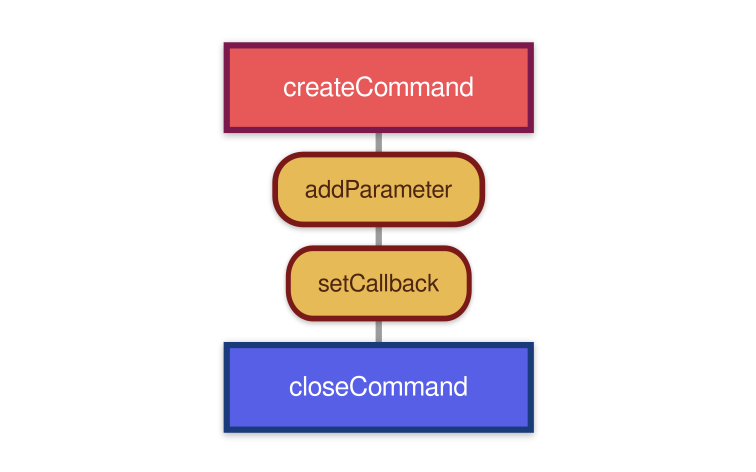

# udmilla-whatsapp-bot

**Udmilla** is a small bot for Whatsapp made with [whatsapp-web.js](https://github.com/pedroslopez/whatsapp-web.js) library using **Typescript**.

<div align="center">

</div>

## Quick links

* [Quick Start](#quick-start)
* [Create command](#create-command)
    * [Command](#create-command)
        * [Alias](#command-alias)
        * [Callback](#command-callback)
        * [Options](#command-options)
        * [info](#command-info)
    * [Parameters](#command-parameters)
        * [Types](#parameter-type)
        * [Default value](#parameter-default-value)
        * [Info](#parameter-info)
* [Send response](#send-response)
* [Examples](#examples)
* [Hot-swap](#hot-swap)


## Quick Start

Node v12+ is required.

### 1. Clone repository

```console
git clone https://github.com/Lautauro/udmilla-whatsapp-bot.git
```

### 2. Install packages

```console
npm i
```

### 3. Build and log in Whatsapp Web

```console
npm run build
npm start
```

Scan the QR code.

### 4. Done

Start playing!

### You can change the command prefix **"."** and other configurations in **src/config/**.

## Create command

Go to **src/modules/commands/** and open **commands_list.ts**.


To create a command you need to use the [createCommand](#create-command) function.

```js
createCommand(['alias'],
    callback(),
    { 
        // Command options
        // * Optional
    },
    { 
        // Command info
        // * Optional, but recommended
    })
.closeCommand(); // Add command to list
```

It is very important not to forget to add "closeCommand" at the end, otherwise the command will not be recognised by the bot.

<div align="center">

</div>

### Command alias:

Names by which the command can be invoked

```js
createCommand(['ping', 'pingpong', 'p']) /* etc... */
```
### Command callback:

When a command is invoked, this function is called. You can read the arguments passed by the user using the "args" variable, and use the "message" object to interact with the chat.

```js
createCommand(['alias'],
    // My callback:
    (args, message) => {
        if (args[0] === 'Hi') {
            // Send "Hello!"
            send_response('Hello!', message);
        } else {
            // Send "Bye!"
            send_response('Bye!', message);
        }
    } /* etc... */)
.closeCommand(); // Add command to list
```
[Send Response](#send-response)

### Command options:

```js
{
    // If true, command can only be executed by admin
    adminOnly: boolean,

    // The command must be or not a quoted message
    needQuotedMessage: boolean,
}
```

### Command info:

This information will be used by the "help" command to describe the command itself.

```js
{
    name: string,           // Command name
    description: string     // What it does
}
```

## Command Parameters:

```js
addParameter(ParameterType, defaultValue?, ParameterInfo?);
```

### Parameter Type:
```ts
type ParameterType = 'string' | 'number' | 'boolean' | 'any';
```

### Parameter default value:

If the parameter is an optional argument, set its default value here. Otherwise, **undefined** should do the trick.

### Parameter info:

This information will be used by the "help" command to describe the parameter.

```js
{
    name: string,           // Parameter name
    description: string,    // What it does
    example: string         // Example value for parameter
}
```

### Example:

```ts
createCommand(['foo'], (args, message) => {
        // Do something
    })
    .addParameter('string', undefined, { name: 'Argument', description: 'Parameter 1 description', example: 'Lorem ipsum dolor' })
    // You should always put optional parameters at the end, such as the following. Otherwise it may cause problems.
    .addParameter('boolean', true, { name: 'Optional Argument', description: 'Parameter 2 description', example: 'true' })
    // ... etc ...
.closeCommand()
```

<div align="center">

</div>

## Send Response

Send a message to a chat.

```js
send_response(MessageContent, MessageObj, options?)
```

For **MessageObj** info see: https://docs.wwebjs.dev/Message.html

### Message Content

```ts
type MessageContent = string | MessageMedia | Location | Poll | Contact | Contact[] | List | Buttons
```

See: https://docs.wwebjs.dev/Client.html#sendMessage

### Command response options

```js
// All are optional
{
    reply: boolean;     // Send message as a reply
    asError: boolean;   // Send message as error
    reaction: string;   // Reaction to message. Example: "🐕‍🦺"
    messageOptions: MessageSendOptions;
}
```

For more information on MessageSendOptions, see: https://docs.wwebjs.dev/global.html#MessageSendOptions

## Examples:

Command with **no arguments**
```js
createCommand(['ping', 'pingpong'], (args, message) => {
        send_response('Pong!', message, { reaction: '🏓' })
    },
    // Command options
    { adminOnly: true },
    // Command info
    {
        name: 'Ping',
        description: 'Ping-pong! 🏓',
    })
.closeCommand();
```

<div align="center">

</div>


Command with arguments:

```ts
createCommand(['repeat'], (args, message) => {
        let msgToSend: string = args[0];

        for (let i = 1; i < args[1]; i++) {
            msgToSend += '\n' + args[0];
        }

        send_response(msgToSend, message, { reply: true }); // Send as reply
    }, null, {
        name: 'Repeat text'
    })
    .addParameter('string', undefined, { name: 'Text', description: 'Text to repeat.', example: 'Hello x5' })
    // You should always put optional parameters at the end, such as the following. Otherwise it may cause problems.
    .addParameter('number', 1, { name: 'Times', description: 'Number of times repeated.', example: '5' })
.closeCommand()
```

<div align="center">

</div>

Command with **quoted message**:

```ts
createCommand(['quote', 'cite'],
    async (args, message) => {
        message.getQuotedMessage()
        .then((quotedMessage) => {
            const msgToSend = `*" ${quotedMessage.body} "*\n\n` + `- _${quotedMessage._data.notifyName}_`;
            send_response(msgToSend, message);
        })
    },
    // Command options
    { needQuotedMessage: true },
    // Command info
    {
        name: 'Quote this',
        description: 'This command makes an author quote with the selected message. It needs to quote a message to work.'
    })
.closeCommand();
```

## Hot-swap

TODO