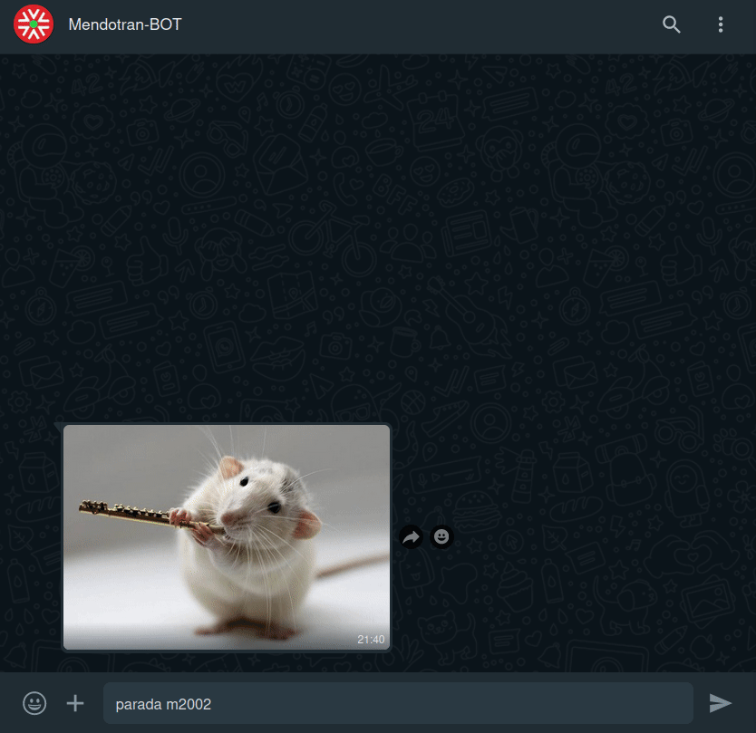
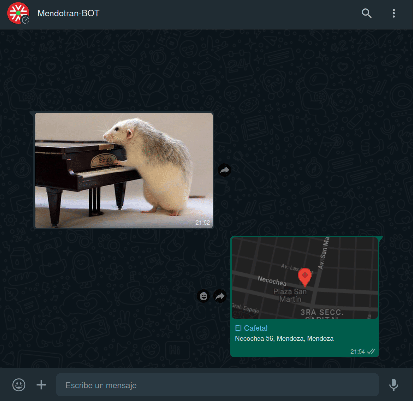

<h1 align="center">mendotran-whatsapp-bot</h1>

**Mendotran-whatsapp-bot**, como su nombre bien sugiere, es un bot para WhatsApp el cual nos permite, valiéndose del servicio **Mendotran**, saber los horarios de una parada de colectivos a través del uso de comandos.

<div align="center">

</div>

<div align="center">

</div>

> [!NOTE]
> Puede omitir la "M" y dejar solo el número de parada.* 

<div align="center">

</div>

En el caso que la parada no posea cartel, o el mismo esté vandalizado, el bot puede [localizarla usando su ubicación](#parada-cercana-a-tu-ubicación).

## Guia
* [Instalación](#instalación)
* [쮺칩mo funciona?](#쯖칩mo-funciona)
* [Parada cercana a tu ubicación](#parada-cercana-a-tu-ubicación)
* [Pros y contras](#pros-y-contras)
* [Lista de comandos](#lista-de-comandos)
* [Cosas por hacer](#cosas-por-hacer)

*Núcleo del bot: [udmilla-whatsapp-bot](https://github.com/Lautauro/udmilla-whatsapp-bot). Librería: [whatsapp-web.js](https://github.com/pedroslopez/whatsapp-web.js)*

## Instalación

> **Aclaración: Al ser usuario de Linux desconozco si esto funciona o no en Windows o Mac, en principio debería pero aún no lo he probado.**

### 1. Clonar el repositorio

```bash
git clone
```

### 2. Instalar paquetes

```bash
npm i
```

### 3. Compilar el proyecto 

```bash
npm run build
```

### 4. Iniciar servidor

```bash
npm start
```

**La primera vez que inicies el servidor sucederán dos cosas:**

1. Se generará una base de datos local que servirá para comunicarse con Mendotran.
2. Tendrá que sincronizar, a través del escaneo de un QR, la cuenta que usará de bot.

## 쮺칩mo funciona?

<div align="center">

</div>

*Fuentes: [smartphone.svg](https://commons.wikimedia.org/wiki/File:Smartphone-.svg) [whatsapp-icon.svg](https://commons.wikimedia.org/wiki/File:2062095_application_chat_communication_logo_whatsapp_icon.svg) [server.svg](https://commons.wikimedia.org/wiki/File:Server2_by_mimooh.svg)*

La primera vez que inicie el bot hará una serie de peticiones al servidor de Mendotran con el fin de generar una base de datos local del mismo, ésta contendrá información sobre los colectivos y paradas de la ciudad de Mendoza. Luego de generarla, puede encontrar el archivo en **/build/json/mendotran-data.json**.

<div align="center">

</div>

Así será más o menos la estructuta de la base de datos.

```json
"stops": {
    "M8845": {
        "id": "1606_62489",
        "position": {
            "lat": "-33.2228834",
            "lon": "-68.8925633"
        },
        "address": "Av. San Martín (Luján de Cuyo, Mendoza)",
        "busList": [
            "701",
            "705",
            "704",
            "708"
        ]
    }
},
"buses": {
    "701": {
        "linea": "701",
        "id": "1606_166733",
        "shortName": "701 UGARTECHE - Bº TIERRA SOL Y LUNA",
        "color": "🟦"
    }
}
```

Todos estos datos serán de gran utilidad para el bot a la hora de solicitar los horarios de un colectivo. Si por algún motivo quiere regenerar este archivo, bastará con iniciar el bot de la siguiente manera:

```bash
npm run refresh
```

El archivo viejo será conservado bajo el nombre de **mendotran-data.json.old** .

> [!NOTE]
> En mi experiencia el número de paradas de colectivo que recolecta varía según si se hace un día de semana o un fin de semana. No estoy seguro del porqué de esto pero es necesario que lo mencione.

## Parada cercana a tu ubicación

Si se desconoce el número de parada, enviando una ubicación el bot se encargará de buscar la parada más cercana y enviar sus horarios.

Comando **"micro"**, para saber un colectivo en específico:

<div align="center">

</div>

Comando **"parada"**, para mostrar todos los colectivos de una parada:

<div align="center">

</div>

## Pros y contras

|PROS |CONTRAS|
|:---:|:---:  |
|En caso de tener WhastApp gratis con su compañía de celular, **no necesita gastar datos entrando a la app oficial de Mendotran**.|**Usted deberá hostear el bot** por su cuenta en un servidor, o bien valerse de uno alojado por otro usuario.|
|Puede hasta ser **más rápido que usar la aplicación oficial**. Esto dependerá de la velocidad del servidor y de la experiencia previa del usuario con el uso de bots.|**Requiere más o menos tiempo habituarse a la lógica de los comandos.** Habrá personas que prefieran el uso de una interfaz gráfica de usuario ([GUI](https://en.wikipedia.org/wiki/Graphical_user_interface)) antes que una interfaz de texto ([TUI](https://en.wikipedia.org/wiki/Text-based_user_interface)).|
|Si la privacidad le parece un tema importante, en principio **ésta forma de usar el servicio debería ser más privada**, ya que no es el cliente quien hace las peticiones a Mendotran sino el servidor (Menos riesgo de recolección de datos). Más info en como usa nuestros datos la app [aquí](https://mendotran.mendoza.gov.ar/politica).|Estás usando WhatsApp, si la privacidad es algo que te concierne probablemente estés en el sitio equivocado. **Mendotran afirma en su [Play Store](https://play.google.com/store/apps/details?id=com.wara.mendotran&hl=es_AR) que no recolecta datos del usuario, sin embargo se contradice en las [políticas de privacidad](https://mendotran.mendoza.gov.ar/politica) de su sitio web.**|
|No tiene que tener instalada la aplicación de Mendotran en su celular, lo que es igual a **más espacio libre**.|**Necesita saber el número de la parada de colectivos**, en el caso contrario puede pedirle al bot que busque la parada más cercana a su ubicación actual. Esto último hace que pierda sentido el punto de usar menos datos, ya que Google Maps precisa de los mismos.|

## Lista de comandos

Para ejecutar un comando debe estar acompañado por el prefijo **"."** *(punto)* seguido del alias del comando *(sin espacio)* y los parámetros *(estos sí espaciados)*.

|Alias|Sintaxis|Función|Ejemplo|
|:---:|:---|:---:|:---|
|**micro<br>m**|micro *[número de micro]* *[número de parada]*|Obtener los horarios de **un colectivo** en una parada.|.micro **120** **M14408**<br>(La "M" es opcional)|
|**parada<br>p**|parada *[número de parada]*|Obtener **todos** los horarios de una parada de colectivos.|.parada **M5707**<br>(La "M" es opcional)|
|**help<br>?**|help *[comando]*|Solicitar información sobre el uso de un comando.|.help **micro**|

También existe la alternativa de localizar una parada por cercanía. Tan solo basta con enviar una ubicación, citarla y utilizar alguno de los comandos. [Vea el ejemplo](#usando-tu-ubicación).

## Cosas por hacer:

Lejos de ser este el estado final del proyecto, aún hay cosas que tengo pensadas implementar en un futuro. Si lo desea y tiene las habilidades para hacerlo puede contribuir al mismo.

- [ ] Buscar estaciones de metro-tranvía por nombre.
- [ ] Almacenar paradas por nombre. Que el usuario pueda guardar una parada / micro por nombre, por ejemplo: "casa", entonces para saber los horarios del colectivo que pasa por su casa solo basta escribir ".micro casa" o ".parada casa".
- [ ] Comando para buscar paradas en cierto radio respecto a una ubicación. Permitiría elegir la parada de la cual se desea saber sus horarios.